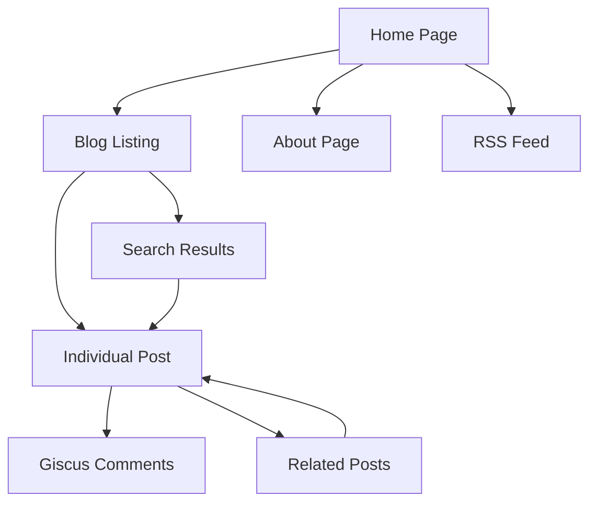

# Astro Personal Blog - Product Requirements Document

## 1. Product Overview

A production-ready personal blog built with Astro static site generator, featuring Content Collections for type-safe content management, integrated search functionality via Pagefind, and community engagement through Giscus comments.

The blog solves the need for developers and content creators to have a fast, SEO-optimized, and maintainable blogging platform with modern developer experience and minimal infrastructure complexity.

## 2. Core Features

### 2.1 Feature Module

Our Astro blog consists of the following main pages:

1. **Home page**: hero section, recent posts list, search functionality
2. **Blog listing page**: paginated post list, category filtering, search interface
3. **Individual post page**: full post content, Giscus comments, related posts
4. **About page**: author information, site description
5. **RSS feed**: automated RSS generation for subscribers
6. **Sitemap**: SEO-optimized sitemap generation

### 2.2 Page Details

| Page Name | Module Name | Feature description |
|-----------|-------------|---------------------|
| Home page | Hero section | Display site title, description, and navigation menu |
| Home page | Recent posts | Show latest 5 blog posts with title, excerpt, date, and tags |
| Home page | Search interface | Pagefind search box for content discovery |
| Blog listing | Post grid | Display all published posts in paginated format with filtering |
| Blog listing | Search functionality | Full-text search across all blog content using Pagefind |
| Blog listing | Tag filtering | Filter posts by tags with dynamic tag cloud |
| Post page | Content display | Render MDX/Markdown content with syntax highlighting and typography |
| Post page | Metadata | Show publication date, update date, reading time, and tags |
| Post page | Comments system | Giscus integration for GitHub Discussions-based comments |
| Post page | Navigation | Previous/next post navigation and related posts suggestions |
| About page | Author info | Static page with author bio, contact information, and site purpose |
| RSS feed | Content syndication | Automatically generated RSS feed for all published posts |
| Sitemap | SEO optimization | XML sitemap generation for search engine indexing |

## 3. Core Process

**Content Creation Flow:**
1. Author creates new Markdown/MDX file in `/src/content/blog/` directory
2. Frontmatter is validated against Zod schema for type safety
3. Content is processed by Astro Content Collections
4. Post appears automatically in blog listing and RSS feed
5. Pagefind indexes content during build process

**User Reading Flow:**
1. User visits homepage or blog listing
2. User can search for specific content using Pagefind interface
3. User clicks on post to read full content
4. User can engage via Giscus comments (requires GitHub account)
5. User can navigate to related posts or return to listing

**Deployment Flow:**
1. Code changes pushed to GitHub repository
2. GitHub Actions triggers build process
3. Astro generates static site
4. Pagefind creates search index
5. Site deployed to Vercel or Cloudflare Pages

## 4. User Interface Design

### 4.1 Design Style

- **Primary colors**: Dark theme with zinc-900 background, white text
- **Secondary colors**: zinc-400 for muted text, zinc-800 for borders and cards
- **Button style**: Rounded corners with hover effects, minimal design
- **Font**: System font stack for optimal performance and readability
- **Layout style**: Clean, minimal design with max-width containers and generous whitespace
- **Icons**: Simple text-based navigation, minimal use of icons for fast loading

### 4.2 Page Design Overview

| Page Name | Module Name | UI Elements |
|-----------|-------------|-------------|
| Home page | Hero section | Large title, subtitle, horizontal navigation menu with hover effects |
| Home page | Posts list | Card-based layout with post title, date, description, and tag pills |
| Blog listing | Search interface | Prominent search box with Pagefind UI styling, responsive design |
| Blog listing | Post grid | Responsive grid layout with consistent card styling and hover states |
| Post page | Content area | Typography-optimized layout with @tailwindcss/typography for readable content |
| Post page | Comments | Giscus iframe with theme matching, positioned below content |
| About page | Content layout | Simple single-column layout with readable typography |

### 4.3 Responsiveness

Desktop-first responsive design with mobile optimization. Touch-friendly navigation and search interface for mobile devices. Responsive typography scaling and flexible grid layouts for optimal viewing across all screen sizes.