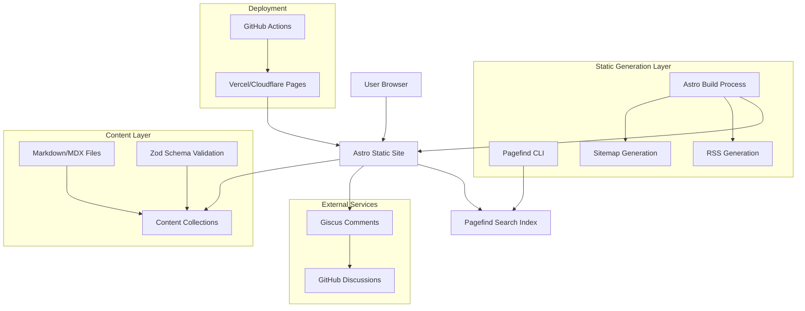
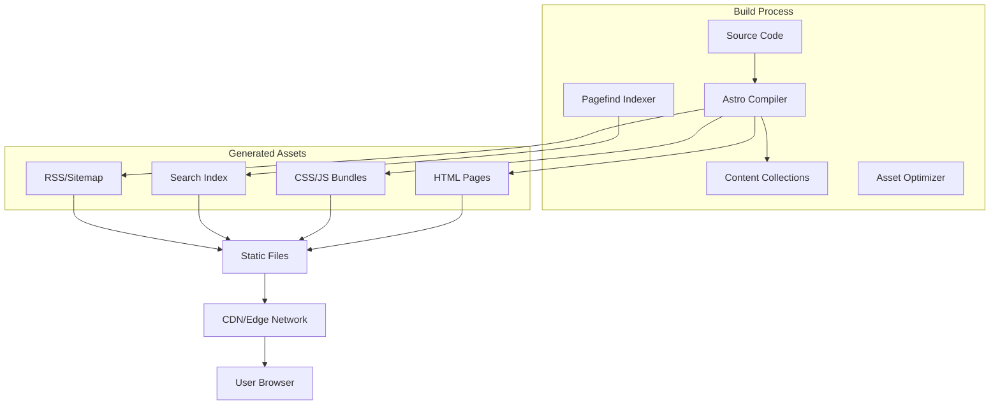
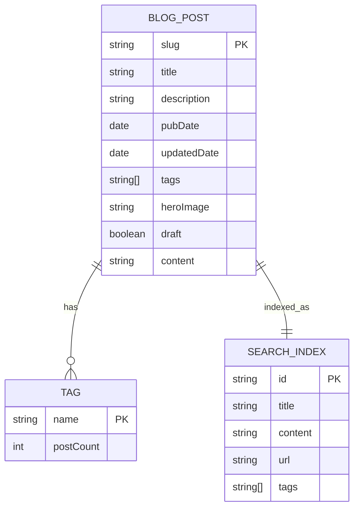

# Astro Personal Blog - Technical Architecture Document

## 1. Architecture Design



## 2. Technology Description

* **Frontend**: Astro\@4 + TypeScript + Tailwind CSS\@3 + Vite

* **Content Management**: Astro Content Collections + Zod validation

* **Search**: Pagefind CLI for static search indexing

* **Comments**: Giscus (GitHub Discussions integration)

* **SEO**: @astrojs/rss + @astrojs/sitemap

* **Development Tools**: ESLint + Prettier + TypeScript strict mode

* **Deployment**: GitHub Actions + Vercel/Cloudflare Pages

## 3. Route Definitions

| Route              | Purpose                                                  |
| ------------------ | -------------------------------------------------------- |
| /                  | Home page with recent posts and site navigation          |
| /blog              | Blog listing page with all posts, search, and pagination |
| /blog/\[slug]      | Individual blog post pages with content and comments     |
| /about             | Static about page with author information                |
| /rss.xml           | RSS feed for blog posts                                  |
| /sitemap-index.xml | XML sitemap for SEO                                      |

## 4. API Definitions

### 4.1 Content Collections API

**Blog Post Schema (Zod)**

```typescript
const blogSchema = z.object({
  title: z.string(),
  description: z.string().min(10),
  pubDate: z.coerce.date(),
  updatedDate: z.coerce.date().optional(),
  tags: z.array(z.string()).default([]),
  heroImage: z.string().optional(),
  draft: z.boolean().default(false)
});
```

**Content Collection Query**

```typescript
// Get all published posts
const posts = await getCollection('blog', ({ data }) => {
  return data.draft !== true;
});

// Get single post by slug
const post = await getEntry('blog', slug);
```

### 4.2 Pagefind Integration

**Search Index Generation**

```bash
# Post-build command
pagefind --source dist
```

**Client-side Search API**

```javascript
// Pagefind UI initialization
new PagefindUI({
  element: '#search',
  showSubResults: true,
  showImages: true,
  translations: {
    search_placeholder: { default: 'Search posts…' }
  }
});
```

### 4.3 Giscus Configuration

**Comment System Parameters**

```typescript
interface GiscusConfig {
  repo: string; // "yourname/yourrepo"
  repoId: string; // "REPO_ID_HERE"
  category: string; // "General"
  categoryId: string; // "CATEGORY_ID_HERE"
  mapping: 'pathname';
  theme: 'dark' | 'light';
}
```

## 5. Server Architecture Diagram



## 6. Data Model

### 6.1 Data Model Definition



### 6.2 File Structure Definition

**Content Organization**

```
/src/content/blog/
├── hello-world.md
├── astro-tips.mdx
└── config.ts
```

**Component Structure**

```
/src/components/
├── Header.astro
├── Footer.astro
├── PostCard.astro
├── Search.astro
└── Giscus.astro
```

**Layout Structure**

```
/src/layouts/
├── BaseLayout.astro
└── PostLayout.astro
```

**Page Structure**

```
/src/pages/
├── index.astro
├── about.astro
├── rss.xml.ts
└── blog/
    ├── index.astro
    └── [slug].astro
```

**Configuration Files**

```
/
├── astro.config.mjs
├── tailwind.config.mjs
├── tsconfig.json
├── .eslintrc.cjs
├── .prettierrc
├── package.json
└── README.md
```

**Build Output Structure**

```
/dist/
├── index.html
├── about/index.html
├── blog/
│   ├── index.html
│   └── [post-slug]/index.html
├── rss.xml
├── sitemap-index.xml
└── pagefind/
    ├── pagefind.js
    ├── pagefind-ui.js
    ├── pagefind-ui.css
    └── index/
```

